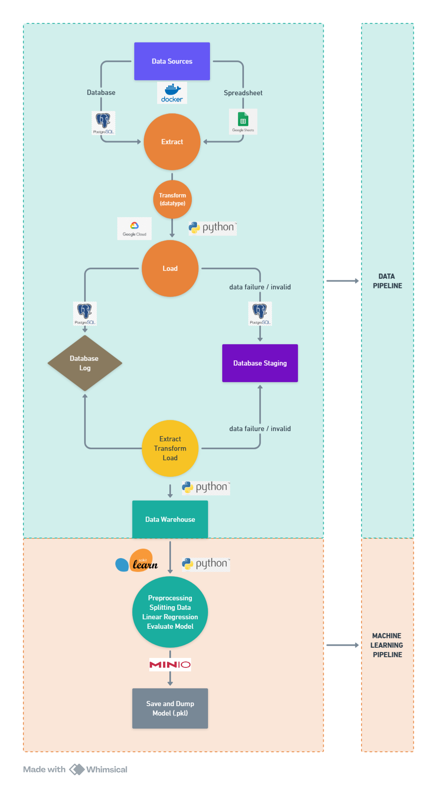
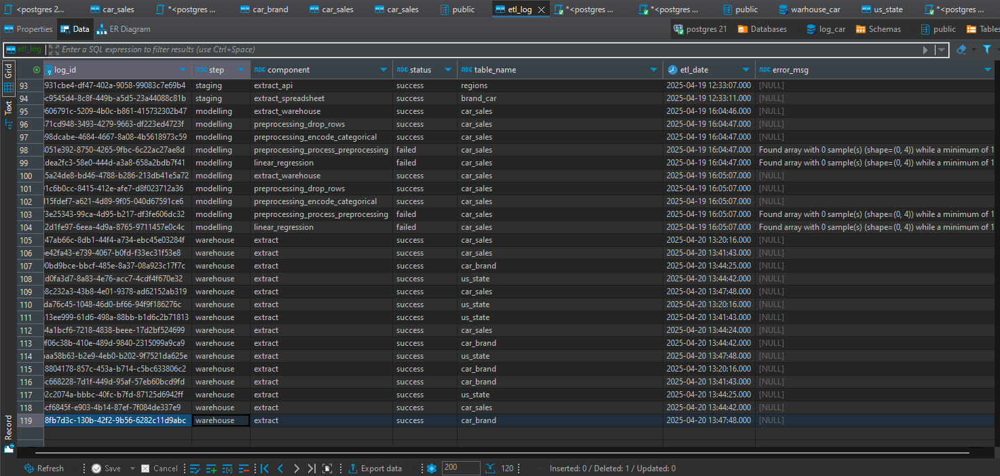

# git

## Table of Contents

- [Project Description](#project-description)
- [Tech Stack](#tech-stack)
- [Data Sources](#data-sources)
- [Problem Statement](#problem-statement)
- [Solution Approach](#solution-approach)
  - [Data Pipeline](#data-pipeline)
  - [Data Exploration](#data-exploration)
  - [Helper Functions](#helper-functions)
- [Machine Learning Pipeline](#machine-learning-pipeline)
- [Activities](#activities)
- [Database Mapping](#database-mapping)
  - [Source to Staging Mapping](#source-to-staging-mapping)
  - [Staging to Warehouse Mapping](#staging-to-warehouse-mapping)
- [How to Run This Project](#how-to-run-this-project)
- [Final Notes](#final-notes)

---

## Project Description

This project implements a full **Data Pipeline** and **Machine Learning Pipeline** for car sales transaction data.  
It automates the extraction, transformation, and loading (ETL) of data from multiple sources, stores clean data into a Data Warehouse, and builds a Machine Learning model for predictive analysis.  
The trained model is stored in a MinIO object storage service for production use.

---

## Tech Stack

| Category                  | Tools and Technologies |
|----------------------------|-------------------------|
| Containerization           | Docker, Docker Compose |
| Programming Language       | Python |
| Data Engineering           | PostgreSQL, SQLAlchemy, Pandas, Google Spreadsheet API, REST API |
| Machine Learning           | Scikit-Learn |
| Object Storage             | MinIO |
| Logging and Monitoring     | PostgreSQL (Logging Table) |
| Development Environment    | Jupyter Notebook |

---

## Data Sources

- **PostgreSQL Database**: Car sales transaction data ([repository](https://github.com/Kurikulum-Sekolah-Pacmann/data_pipeline_exercise_4)).
- **Google Spreadsheet**: [Car Brand Spreadsheet](https://docs.google.com/spreadsheets/d/1nQi-YDX9KRs5mmqT-iAC67nz4QyKLUyLOUpQatY5wOI/edit?usp=sharing) mappings (Brand ID to Brand Name).
- **REST API**: US States information ([API](https://raw.githubusercontent.com/Kurikulum-Sekolah-Pacmann/us_states_data/refs/heads/main/us_states.json)).
- **PostgreSQL (Staging Database)**: Intermediate raw and mapped data ([repository](https://github.com/Kurikulum-Sekolah-Pacmann/data_pipeline_exercise_4)).
- **PostgreSQL (Warehouse Database)**: Final clean and transformed data ([repository](https://github.com/Kurikulum-Sekolah-Pacmann/data_pipeline_exercise_4)).
- **MinIO Storage**: Object storage for trained Machine Learning models (demo in localhost).

---

## Problem Statement

- The car sales data is distributed across multiple sources.
- Raw data is not directly usable for Machine Learning modeling.
- Data cleaning, transformation, and mapping are required before building predictive models.
- A reliable, automated data pipeline is needed to streamline the entire process.

---

## Solution Approach

### Data Pipeline



- **Extract** data from PostgreSQL, Google Spreadsheet, and REST API.
- **Load** raw extracted data into a Staging PostgreSQL database.
- **Transform** data by cleaning, mapping, and validating.
- **Load** the clean transformed data into a Warehouse PostgreSQL database.
- **Logging** is implemented for all pipeline stages.

### Data Exploration ( [Jupyter Notebook](https://docs.docker.com/get-docker/) )

- Reviewed data shape, missing values, and types.
- Dropped redundant columns and NA values.
- Mapped brand and state identifiers correctly.
- Ensured data quality before using it for Machine Learning.

### Helper Functions

- PostgreSQL connection management.
- Google Sheets API access.
- REST API data retrieval.
- Centralized logging utility functions.

---

## Machine Learning Pipeline

- Extract clean data from the Warehouse database.
- Preprocess data with:
  - One Hot Encoding for categorical features.
  - Label Encoding for the target variable.
- Train a Machine Learning model using Scikit-Learn.
- Evaluate model performance.
- Export the trained model to MinIO as a `.pkl` file.

---

## Activities

Summary of the work done in the notebook:

- Cleaned unnecessary columns.
- Dropped N/A rows and ensured type consistency.
- Mapped brand and state columns to their respective IDs.
- Validated clean datasets before loading into the warehouse.
- OneHotEncoded necessary features.
- Trained and saved a Machine Learning model.
- Logged each major operation into a PostgreSQL Logging Table.

---

## Database Mapping

### Source to Staging Mapping

| Source         | Source Field / Logic        | Transformation                  | Target Table | Target Column   |
|----------------|------------------------------|----------------------------------|--------------|-----------------|
| DB: car_sales  | id_sales                     | Direct copy                      | car_sales    | id_sales        |
| DB: car_sales  | year                         | Cast to varchar                  | car_sales    | year            |
| DB: car_sales  | brand_car                    | Direct                           | car_sales    | brand_car       |
| DB: car_sales  | transmission                 | Direct                           | car_sales    | transmission    |
| DB: car_sales  | state                        | Direct                           | car_sales    | state           |
| DB: car_sales  | condition                    | Cast to varchar                  | car_sales    | condition       |
| DB: car_sales  | odometer                     | Cast to varchar                  | car_sales    | odometer        |
| DB: car_sales  | color                        | Direct                           | car_sales    | color           |
| DB: car_sales  | interior                     | Direct                           | car_sales    | interior        |
| DB: car_sales  | mmr                          | Cast to varchar                  | car_sales    | mmr             |
| DB: car_sales  | sellingprice                 | Cast to varchar                  | car_sales    | sellingprice    |
| System         | now()                        | Default timestamp                | car_sales    | created_at      |
| Spreadsheet    | brand_car_id                 | Direct                           | car_brand    | brand_car_id    |
| Spreadsheet    | brand_name                   | Direct                           | car_brand    | brand_name      |
| System         | now()                        | Default timestamp                | car_brand    | created_at      |
| API            | id_state                     | Direct                           | us_state     | id_state        |
| API            | code                         | Direct                           | us_state     | code            |
| API            | name                         | Direct                           | us_state     | name            |
| System         | now()                        | Default timestamp                | us_state     | created_at      |

---

### Staging to Warehouse Mapping

| Staging Table  | Staging Field / Logic         | Transformation                  | Warehouse Table | Warehouse Column |
|----------------|-------------------------------|----------------------------------|-----------------|------------------|
| car_sales      | id_sales                      | Direct copy                     | car_sales_wh    | id_sales         |
| car_sales      | year                           | Direct copy                     | car_sales_wh    | year             |
| car_sales      | brand_car_id (mapped)          | Map brand_car to brand_car_id    | car_sales_wh    | brand_car_id     |
| car_sales      | transmission                  | Direct                          | car_sales_wh    | transmission     |
| car_sales      | id_state (mapped)              | Map state to id_state            | car_sales_wh    | id_state         |
| car_sales      | condition                     | Direct                          | car_sales_wh    | condition        |
| car_sales      | odometer                      | Direct                          | car_sales_wh    | odometer         |
| car_sales      | color                         | Direct                          | car_sales_wh    | color            |
| car_sales      | interior                      | Direct                          | car_sales_wh    | interior         |
| car_sales      | mmr                           | Direct                          | car_sales_wh    | mmr              |
| car_sales      | sellingprice                  | Direct                          | car_sales_wh    | sellingprice     |
| System         | now()                         | Default timestamp               | car_sales_wh    | created_at       |

---

## How to Run This Project

### Prerequisites

- Install [Docker](https://docs.docker.com/get-docker/) and [Docker Compose](https://docs.docker.com/compose/install/).
- Install [Git](https://git-scm.com/).

### Clone the Repository

```bash
git clone https://github.com/your-username/your-repository.git
cd your-repository
```

### Environment Variables

Create a `.env` file in the root project directory. Example `.env` content:

```env
# Source
SRC_POSTGRES_DB=source_car
SRC_POSTGRES_HOST=...
SRC_POSTGRES_USER=...
SRC_POSTGRES_PASSWORD=...
SRC_POSTGRES_PORT=...

# Staging
STG_POSTGRES_DB=staging_car
STG_POSTGRES_HOST=...
STG_POSTGRES_USER=...
STG_POSTGRES_PASSWORD=...
STG_POSTGRES_PORT=...

# Warehouse
WH_POSTGRES_DB=warhouse_car
WH_POSTGRES_HOST=...
WH_POSTGRES_USER=...
WH_POSTGRES_PASSWORD=...
WH_POSTGRES_PORT=...

# Log
LOG_POSTGRES_DB=log_car
LOG_POSTGRES_HOST=...
LOG_POSTGRES_USER=...
LOG_POSTGRES_PASSWORD=...
LOG_POSTGRES_PORT=...

# MinIo
MINIO_ACCESS_KEY=...
MINIO_SECRET_KEY=...

# Spreadsheet
CRED_PATH=".\creds\xxxxxx.json"
KEY_SPREADSHEET ="xxxxxxx"                            
```

Adjust the values according to your environment setup.

### Start the Containers

Use Docker Compose to start all required services:

```bash
docker-compose up --build
```

This will automatically:

- Launch PostgreSQL database (Staging and Warehouse).
- Launch MinIO server.
- Start the application environment.

### Access the Services

- PostgreSQL: `localhost:5432`
- MinIO Web UI: `localhost:9000`
- Jupyter Notebook : `localhost:8888`

### Running the Pipeline

Open the provided Jupyter Notebook and execute each section in order to:

- Run the ETL Data Pipeline.
- Run the Machine Learning Pipeline.
- Save the trained model to MinIO.

---

## Final Notes

This project delivers a complete, real-world data engineering and machine learning solution, covering:

- Multi-source ETL pipelines.
- Data cleaning, mapping, and warehousing.
- Machine Learning modeling and evaluation.
- Object storage integration with MinIO.
- Logging and monitoring.

The code and architecture follow best practices for modularity, scalability, and maintainability.

---

## Documentation

